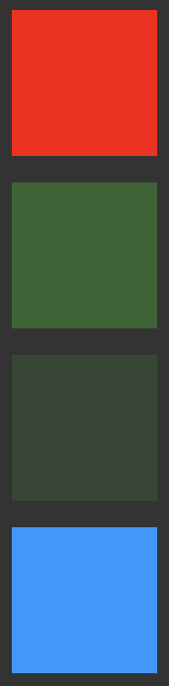

# Css Color Formats

## Task

Create 3 boxes and color them in all colors formats available in css.

## Description

- Hexa-Decimal

    ```css
        #box4 {
            width: 100px;
            height: 100px;
            background-color: #0099FF
        }
    ```

- RGB Colors

    ```css
        #box2 {
            width: 100px;
            height: 100px;
            background-color: rgb(50,100,50);
        }
    ```

- RGBA Colors

    ```css
        #box3 {
            width: 100px;
            height: 100px;
            background-color: rgba(50,100,50,0.4);
        }
    ```

- Colors by Names

    ```css
    #box1 {
        width: 100px;
        height: 100px;
        background-color: red;
    }
    ```

## Snapshots

